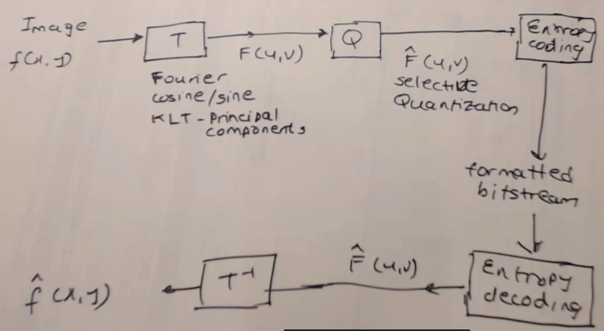
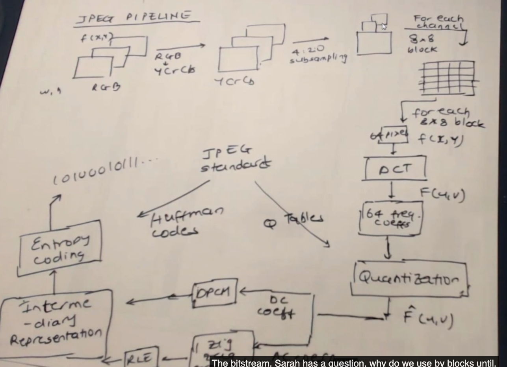

- why we need an alpha channel
	- transparancy
	- composit images
	- why alpha channel also use 8 bits: make the composit more natura

## Lossless
- RLE
	- tiff
	- rlq
	- pict
- Dictionary
	- GIF
	- PNG
- Prediction
	- JPEG Lossless
- Statistical encoding

## Lossy
- spatial domain
	- scalar quantization
	- vector quantization
- transform domain
	- DFT
	- DCT 
		- JPEG
- subband
	- wavelet
	- JPEG 2000
- fractal

## Lossy image compression routine

## JPEG pipelin

In our perception, lower frequencies are more dominant than higher frequenciese.

What does this pipeline give us? It gives us bitrate syntax.

Why 8\*8 in 640\*480*? Low enough so that the pixels were correlated.

缺点：一块一块的，block之间会有边界，所以引入JPEG 2000
