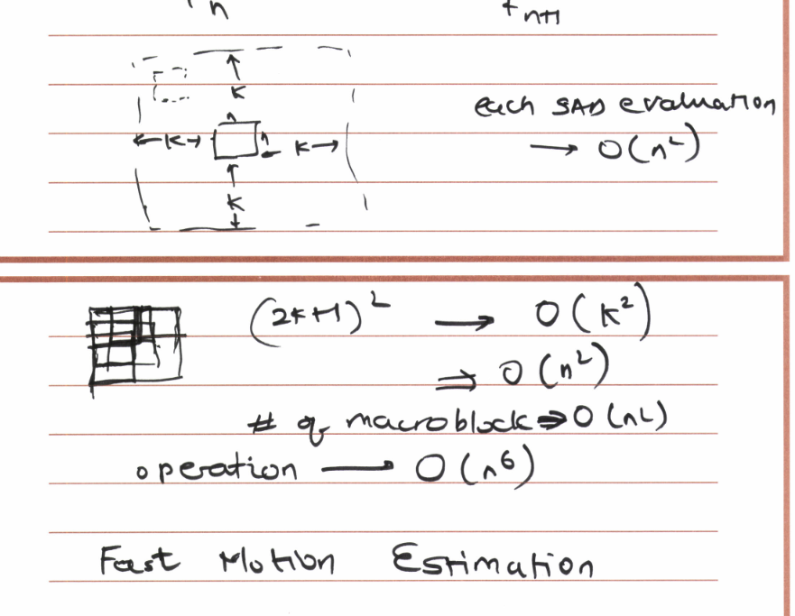

# Video compression
predict next frame. object in motion move consistently. 

- MAD (mean absolute difference)
- MSD (mean square difference)
- SAD (sum of absolute difference) 
- Pel difference classification (threshold)
- Projective ordering

经常用$16\times16$的方格来代表object，并进行计算。

## How do the block size affect the prediction?
Bigger block size makes the entropy higher. But smaller block size would take more computation resource.
## Why should the block be square?
We want to use a shape that bias our error to give us least difference.

The b frames have lower entropy so that they are encoded well, which leads to predicting a b frame from a b frame very hard.
## Complexity

## Fast motion estimation
## Hierarchical search
## GOPs
